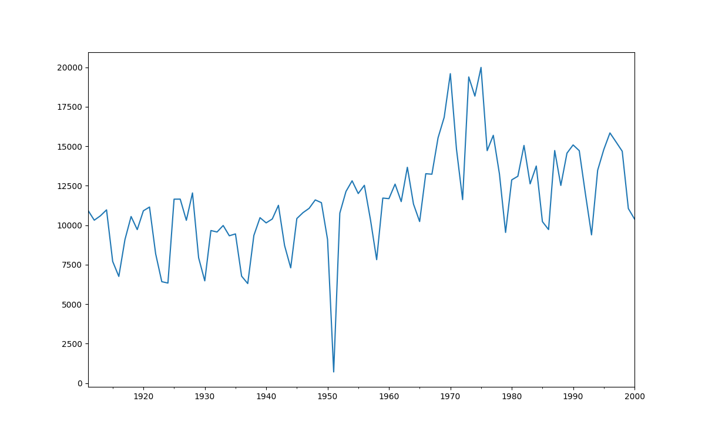
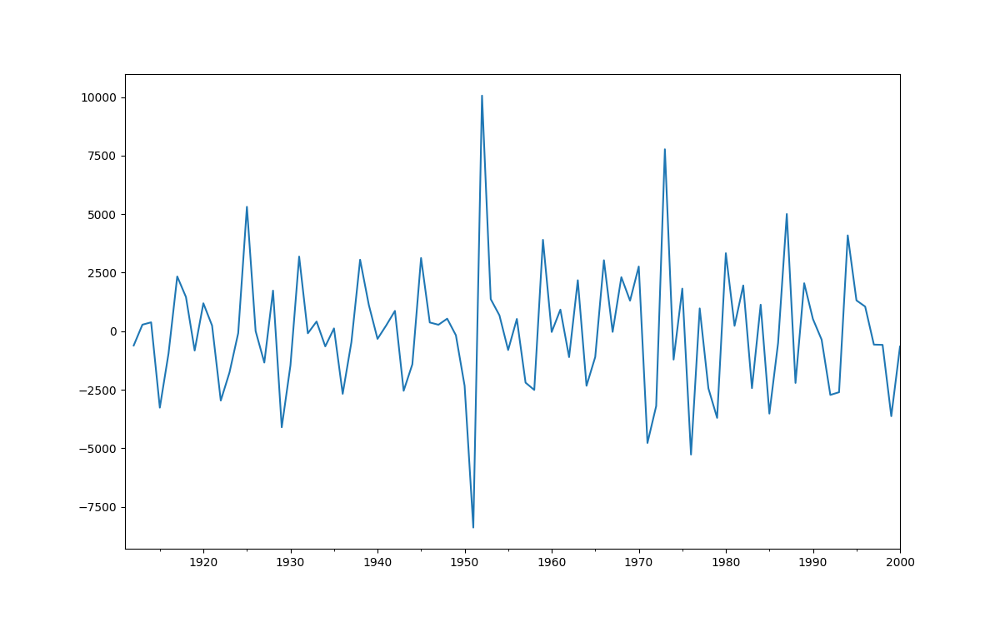
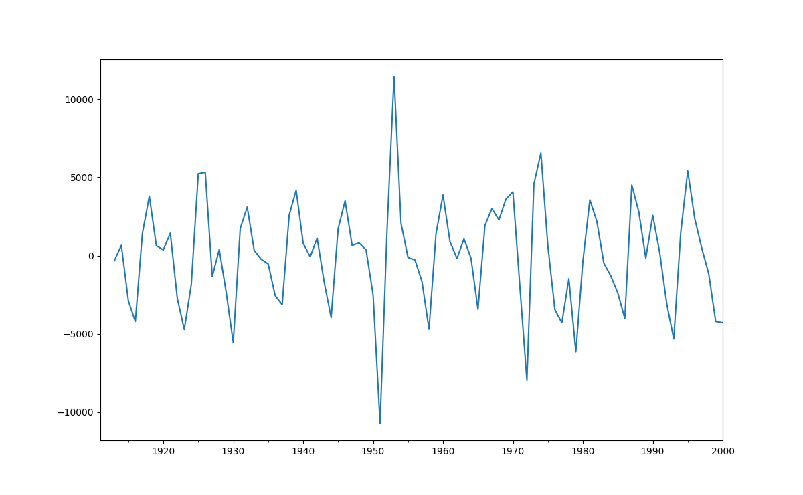
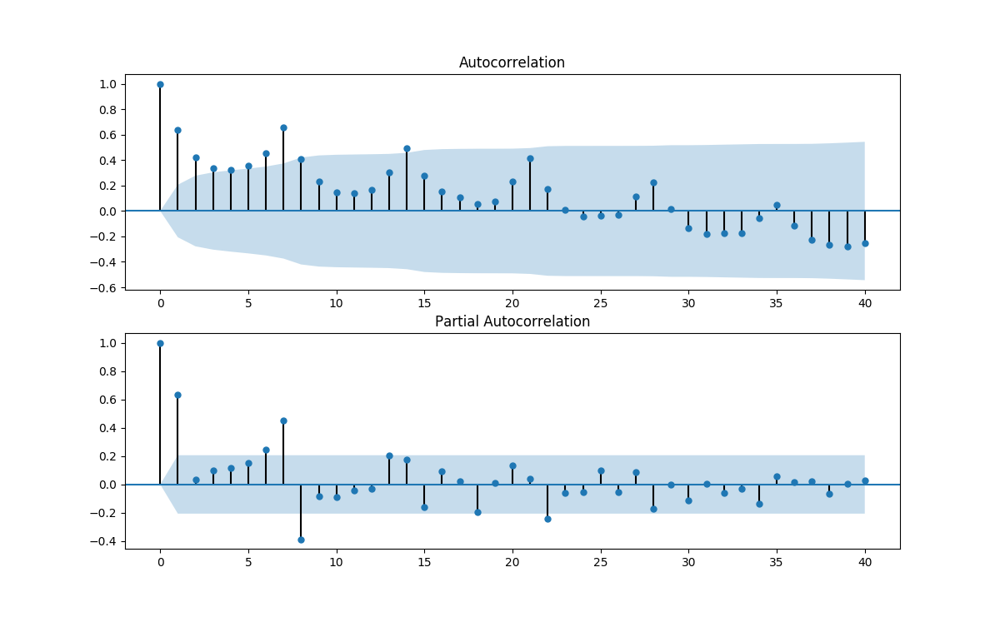
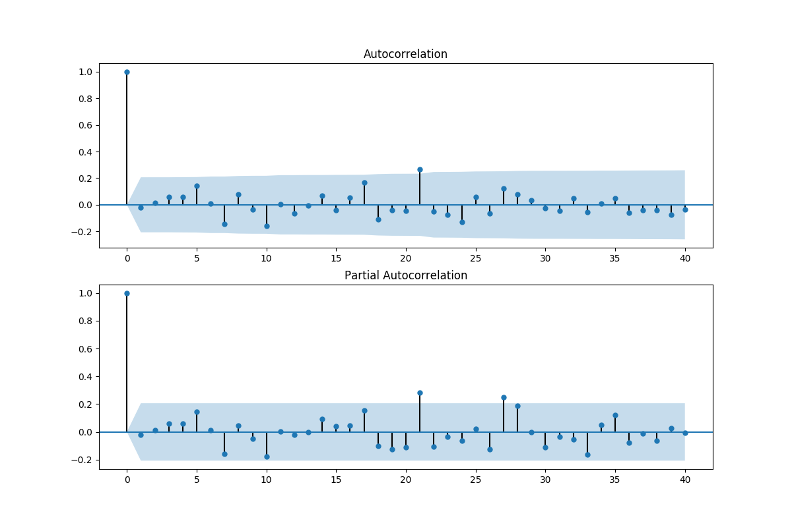
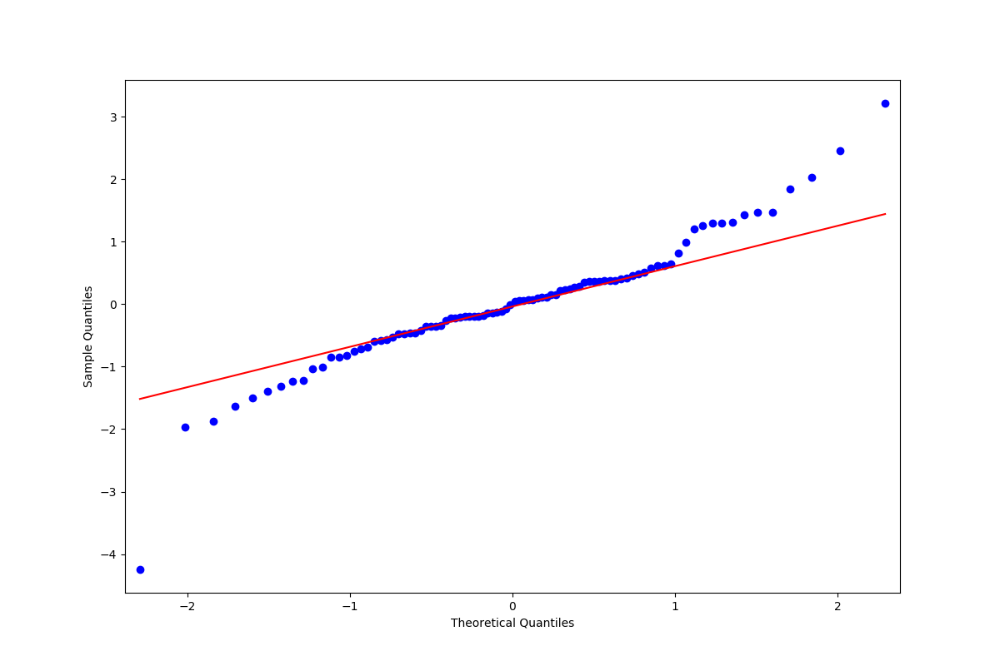

# 基于Python语言的ARIMA模型算法

### 序

时间序列数据在生产生活中极为常见。本文试图利用Python丰富的程序包，来建立适当的数学模型，对其进行描述和处理。

### 1、时间序列模型与ARIMA模型

时间序列的建模与预测在学术界和实际应用领域极为广泛。如股市价格、经济增长、人口数量等问题。1970年，美国的GEP Box和GM Jenkins发表了《[Time Series Analysis: Forecasting and Control](http://xueshu.baidu.com/s?wd=paperuri%3A%28715e90892dfadd5708d83ebc3e2110e2%29&filter=sc_long_sign&tn=SE_xueshusource_2kduw22v&sc_vurl=http%3A%2F%2Fwww.ams.org%2Fmathscinet-getitem%3Fmr%3D272138&ie=utf-8&sc_us=5034082631192868346)》。自那以来，逐渐形成了一整套时间序列的估计、建模和预测的理论方法。

时间序列序列数据的存在和应用十分普遍，但是其数据特点却不完全相同，如果根据数据的特点，来建立合适的模型，以反应其特点、相对准确的预测其发展趋势，是时间序列分析中的重要问题。时间序列数学建模的理论，主要是建立在随机过程的基础之上；而计算机算法的发展，则为其建模带来的极大的方便。

时间序列数据模型中，最为普遍和简单的一种，就是ARIMA模型。

##### 1）自回归模型 (AR, autoregression)

随机过程{$Y_t$}如果满足： $Y_t=c+\phi_1 \cdot Y_{t-1}+\mu_t$，且$\mu_t$的统计性质满足白噪音，则称{$Y_t$}为一个$AR(1)$过程。如果滞后项的阶数为$p$，则为$AR(p$)过程。

##### 2）移动平均模型 (MA, moving average)

随机过程${Y_t}$如果满足：$Y_t = c+\theta \cdot \mu_{t-1} + \mu_t$，且$\mu_t$的统计性质满足白噪音，则称{$Y_t$}为一个$MA(q)$过程。如果滞后项的阶数为$q$，则为$MA(q)$过程。

##### 3)ARMA与ARIMA模型

随机过程${Y_t}$如果满足：$Y_t = c+\phi \cdot Y_{t-1}+ \theta \cdot \mu_{t-1} + \mu_t$，且$\mu_t$的统计性质满足白噪音，则称{$Y_t$}为一个$ARMA(1,1)$过程。如果自回归项的滞后阶数为$p$，移动平均项滞后阶数为$q$，则为$ARMA(p,q)$模型。

如果其中包含单位根过程，且单位根的阶数为1，则为$ARIMA(p,1,q)$过程。

当$ARIMA(p,1,q)$模型建立之后，通常需要对模型进行检验，以判断模型的拟合程度和预测准确度。通常的检验包括：

### 2、Python语言处理时间序列模型

下面试着用Python语言来处理时间序列模型。

首先导入计算模块。pandas, numpy, scipy, 和statsmodels是常用的数理统计模块，matplotlib则是常用的数据可视化的模块，在这里导入用来观察数据的趋势。

```python
from __future__ import print_function
import pandas as pd
import numpy as np
from scipy import  stats
import matplotlib.pyplot as plt
import statsmodels.api as sm
from statsmodels.graphics.api import qqplot
```

然后，输入数据。这是一个包含90个观测值的时间序列数据。

```python
#input the data
dta=[10930,10318,10595,10972,7706,6756,9092,10551,9722,10913,11151,8186,6422,6337,11649,11652,10310,12043,7937,6476,9662,9570,9981,9331,9449,6773,6304,9355,10477,10148,10395,11261,8713,7299,10424,10795,11069,11602,11427,9095,707,10767, 12136,12812,12006,12528,10329,7818,11719,11683,12603,11495,13670,11337,10232,13261,13230,15535,16837,19598,14823,11622,19391,18177,19994,14723,15694,13248, 9543,12872,13101,15053,12619,13749,10228,9725,14729,12518,14564,15085,14722, 11999,9390,13481,14795,15845,15271,14686,11054,10395]
```

然后，我们对数据进行初步的检查和处理。

```python
## change data type
dta=np.array(dta,dtype=np.float)
dta=pd.Series(dta)
dta.index = pd.Index(sm.tsa.datetools.dates_from_range('1911','2000'))
dta.plot(figsize=(12,8))
# general view of the data
dta.plot(figsize=(12,8))
plt.show()
```

可以得到下图：



然后，我们对数据进行一阶差分，使其变得更为平稳。

```python
## difference 1-order
fig = plt.figure(figsize=(12,8))
ax1= fig.add_subplot(111)
diff1 = dta.diff(1)
diff1.plot(ax=ax1)
plt.show()
```



如果不满意，可以继续进行二阶差分。

```python
## difference 2-order
fig = plt.figure(figsize=(12,8))
ax2= fig.add_subplot(111)
diff2 = dta.diff(2)
diff2.plot(ax=ax2)
plt.show()
```



但是由于一阶差分的结果已经能够满足平稳，而且相对模型更为简单。所以之后的分析以一阶差分为基础。

为了确定自回归和移动平均的阶数，通常的一个简单的办法是观察自相关 (acf, autocorrelation function) 和偏自相关(pacf, partial autocorrelation funcition) 系数的情况。于是我们对一阶差分的acf和pacf作图观察。

```python
## acf and pacf
diff1= dta.diff(1)
dta=dta.diff1
fig = plt.figure(figsize=(12,8))
ax1=fig.add_subplot(211)
fig = sm.graphics.tsa.plot_acf(dta,lags=40,ax=ax1)
ax2 = fig.add_subplot(212)
fig = sm.graphics.tsa.plot_pacf(dta,lags=40,ax=ax2)
plt.show()
```



这里的自相关系数拖尾，偏自相关系数截尾，而且偏自相关在$lag=8$时有明显截尾的趋势，所以通过AIC和BIC准则对模型的$AR(7)$或$AR(8)$进行比较。

```python
## model specification, AIC and BIC
arma_mod70 = sm.tsa.ARMA(dta,(7,0)).fit()
print(arma_mod70.aic,arma_mod70.bic,arma_mod70.hqic)
arma_mod30 = sm.tsa.ARMA(dta,(0,1)).fit()
print(arma_mod30.aic,arma_mod30.bic,arma_mod30.hqic)
arma_mod71 = sm.tsa.ARMA(dta,(7,1)).fit()
print(arma_mod71.aic,arma_mod71.bic,arma_mod71.hqic)
arma_mod80 = sm.tsa.ARMA(dta,(8,0)).fit() 
print(arma_mod80.aic,arma_mod80.bic,arma_mod80.hqic)
```

最终确定AR的滞后阶数为8，MA的滞后阶数为0，即模型为$ARIMA(8,1,0)$模型（进行了一次差分）。

然后对模型进行进一步的检验。

- 对残差的检验：通过残差的ACF和PACF可以看出，残差基本满足白噪声的条件。 

```python
## residual
resid = arma_mod80.resid
fig = plt.figure(figsize=(12,8))
ax1 = fig.add_subplot(211)
fig = sm.graphics.tsa.plot_acf(resid.values.squeeze(), lags=40, ax=ax1)
ax2 = fig.add_subplot(212)
fig = sm.graphics.tsa.plot_pacf(resid, lags=40, ax=ax2)
plt.show()
```



- 对正态性的检验。结果看，正态性的条件符合得很好。

  ```python
  ##Normarity test
  print(stats.normaltest(resid))
  fig = plt.figure(figsize=(12,8))
  ax = fig.add_subplot(111)
  fig = qqplot(resid, line='q', ax=ax, fit=True)
  plt.show()
  ```

> NormaltestResult(statistic=14.604690828509506, pvalue=0.00067395621352767988)



- D-W 检验。检验残差项的自相关情况。

  ```python
  ##D-W test
  print(sm.stats.durbin_watson(arma_mod80.resid.values))
  ```

  > 2.04167903544

- Ljunng-Box 检验。对模型的拟合效果进行综合检验。（输出略）

  ```python
  ##Ljunng-Box test
  r,q,p = sm.tsa.acf(resid.values.squeeze(), qstat=True)
  data = np.c_[range(1,41), r[1:], q, p]
  table = pd.DataFrame(data, columns=['lag', "AC", "Q", "Prob(>Q)"])
  print(table.set_index('lag'))
  ```

### 3、总结

利用程序语言进行时间序列的分析，可以大大提高效率。在已有的成熟的统计软件如Stata/SAS/Eviews 等中，已经有了处理时间序列数据的相关内置函数或程序包，但是无论是计算效率、数据可视化的能力，还是灵活程度、开源性，都远远逊色于Python。本文仅仅对Python语言处理ARIMA模型进行简单的讨论和学习，希望能随着Python语言和算法的深入学习，掌握更多的处理ARIMA等时间序列模型的技巧。

------

### 参考文献：

1. Autoregressive Moving Average (ARMA): Sunspots data, url: http://statsmodels.sourceforge.net/devel/examples/notebooks/generated/tsa_arma_0.html#autoregressive-moving-average-arma-sunspots-data.
2. Python_Statsmodels包_时间序列分析_ARIMA模型, url:http://blog.csdn.net/hal_sakai/article/details/51965657.
3. [美]沃尔特·恩德斯(著),杜江、谢志超(译).应用计量经济学——时间序列分析(第2版),高等教育出版社.
4. 涂云东,时间序列分析课堂讲义.
5. 周广旭. (2005). 一种新的时间序列分析算法及其在股票预测中的应用. *计算机应用*, *25*(9), 2179-2181.


